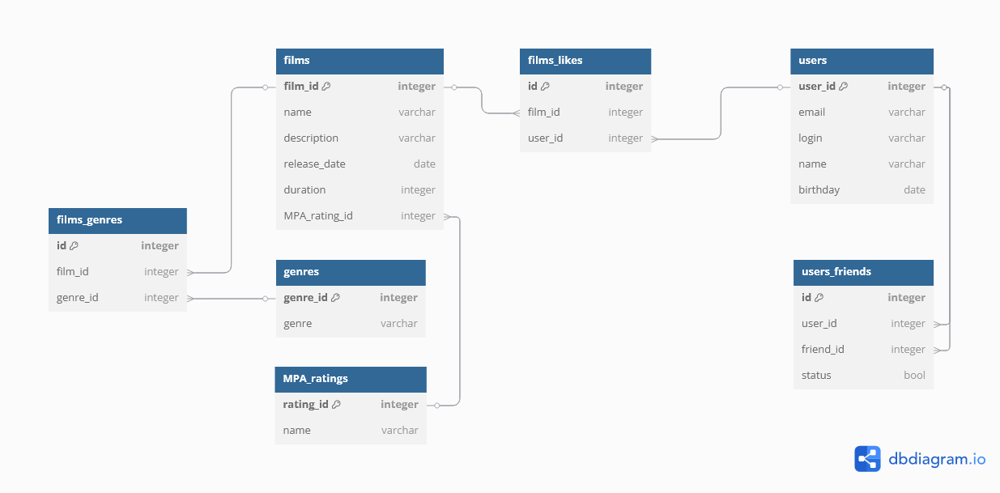

# java-filmorate


##### Review

- Олег говорил на семинаре, что статус добавления в друзья **можно не реализовывать для выполнения задания** (на твое усмотрение).

- На важные поля, такие как email, login можно было наложить constraint'ы и выделить их not null, unique. Unique правда не отображается на диаграмме в DBDiagram, но NN наглядно показывает обязательные поля.

- Так же для наглядных связей можно сделать constraint на связь к примеру film -> films_genres. У фильма обязательно будет жанр в кинотеатре, чтобы он мог фильтроваться по жанру и пользователь мог найти желаемый фильм по жанру. На диаграмме такое в таблицу genre отображается как

```Diagram
[ref: > film.id, not null]
```
